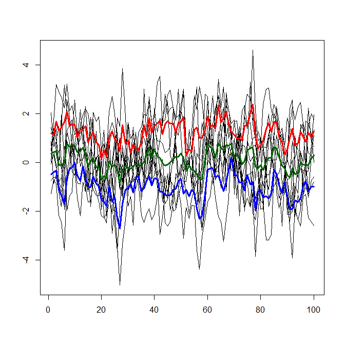

[](http://quantlet.de/)

## [](http://quantlet.de/) **LQR_expectilecurves** [](http://quantlet.de/)

```yaml

Name of Quantlet : LQR_expectilecurves

Published in : Local Quantile Regression

Description : 'Plots the expectile curves (pointwise estimation by LAWS) under several tau levels
with simulated data.'

Keywords : plot, expectile, curve, tail, simulation

Author : Chen Huang, Petra Burdejova

Submitted : Thu, January 12 2017 by Chen Huang

Example : Expectile curves with tau = 0.1, 0.5, 0.9

```




### R Code:
```r

## clear history
rm(list = ls(all = TRUE))
graphics.off()

## generating data
n = 100
m = 10
y = 0
c = 0.8
set.seed(2017)
for (j in 1:m) {
    innov = rnorm(n, mean = 0, sd = 0.5)
    xx    = seq(0, 1, length = n)
    y     = cbind(y, c * sin(2 * pi * xx) + innov)
}
y = y[, -1]
plot(xx, y[, 1], ylab = "", xlab = "", type = "l", col = "white", ylim = c(min(y), 
    max(y)))
## plot the curves
for (j in 1:m) {
    lines(xx, y[, j])
}

## LAWS for vector, return (1-dim)expectile at given tau level
laws1D = function(vec0, tau0) {
    n  = length(vec0)
    e0 = mean(vec0)
    repeat {
        i_pos = vec0 >= e0
        n_pos = sum(i_pos)
        i_neg = vec0 < e0
        n_neg = sum(i_neg)
        e0    = as.numeric((tau0 * (i_pos %*% vec0) + (1 - tau0) * (i_neg %*% vec0))/(sum(tau0 * 
            i_pos) + sum((1 - tau0) * i_neg)))
        if (all((vec0 >= e0) == i_pos)) {
            break
        }
    }
    return(e0)
}

## compute and plot the expectile curves
tau = c(0.1, 0.5, 0.9)
e   = matrix(0, nrow = n, ncol = length(tau))
for (i in 1:n) {
    for (t in 1:length(tau)) {
        e[i, t] = laws1D(y[i, ], tau[t])
    }
}
lines(xx, e[, 1], lwd = 3, col = "blue")
lines(xx, e[, 2], lwd = 3, col = "darkgreen")
lines(xx, e[, 3], lwd = 3, col = "red")

```
