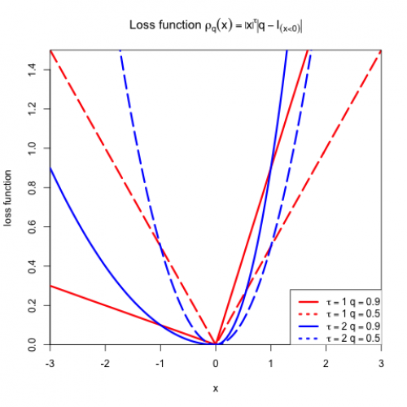

##  **LQRcheck**


```yaml
Name of QuantLet : LQRcheck

Published in : Local Quantile Regression

Keywords : 
- expectile
- quantile
- loss function
- asymmetric
- quantile regression
- plot

See also : 
- LAWS
- LFrobust
- LQRlidar
- LQRquantilecurve

Author : 
- Petra Burdejova

Submitted : Tue, February 25 2014 by Maria Osipenko

Input : 
- x : grid
- q : quantile/expectile level

Example : 'An example is generated for predefined xgrid [-3,3], q = 0.5 and q = 0.9.'

```



```R
# clear all variables
rm(list = ls(all = TRUE))
graphics.off()

rho_q = function(u, q) {
    f = ifelse(u < 0, abs(q - 1) * abs(u), abs(q) * abs(u))
    list(f = f)
}
rho_e = function(u, q) {
    f = ifelse(u < 0, abs(q - 1) * u * u, abs(q) * u * u)
    list(f = f)
}

q_050     = 0.5
q_090     = 0.9
ngrid     = 120
xgrid     = -3 + 6 * (0:ngrid)/(ngrid)
y_rho1_05 = rho_q(xgrid, q_050)
y_rho1_09 = rho_q(xgrid, q_090)
y_rho2_05 = rho_e(xgrid, q_050)
y_rho2_09 = rho_e(xgrid, q_090)

plot_title = expression(paste("Loss function ", rho[q](x) == abs(x)^{
    tau} * abs(q - I[(x < 0)])))
plot(xgrid, y_rho1_05$f, type = "l", col = "red", lwd = 3, lty = 5, cex.axis = 1, 
    xaxs = "i", yaxs = "i", xlab = "x", ylab = "loss function", main = plot_title)
lines(xgrid, y_rho1_09$f, type = "l", col = "red", lwd = 3)
lines(xgrid, y_rho2_05$f, type = "l", col = "blue", lwd = 3, lty = 5)
lines(xgrid, y_rho2_09$f, type = "l", col = "blue", lwd = 3)

legend(1.35, 0.28, c(expression(paste(tau == 1, " ", q == 0.9)), expression(paste(tau == 
    1, " ", q == 0.5)), expression(paste(tau == 2, " ", q == 0.9)), expression(paste(tau == 
    2, " ", q == 0.5))), text.width = 8, lwd = c(3, 3, 3, 3), lty = c(1, 3, 1, 3), 
    col = c("red", "red", "blue", "blue"))
